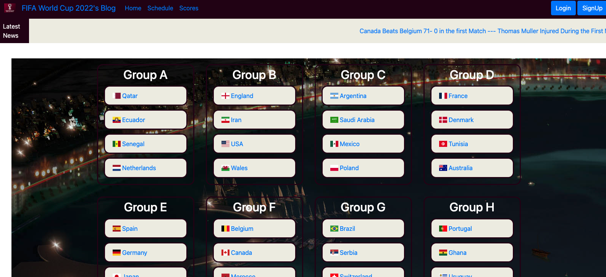

# vigilant-octo-lamp

## FIFA World Cup 2022 Fan Site - Project 2

- *What was your motivation?*  We wanted to create a fun fan site for the 2022 FIFA WORLD CUP 
- *What did I learn?* We learned how to create relationships between multiple tables. We learned that it was easier to not have multiple people working in the same files, so that we could avoid GitHub merge errors and conflicts. We also learned how to seed a database that has been deployed to Heroku. We also learned how to research, find and implement a new NPM package to use in our project.

## Installation

*What are the steps required to install your project? Provide a step-by-step description of how to get the development environment running.*

Go to https://vigilant-octo-lamp.herokuapp.com/ and the page should load and function properly. 

Alternatively, if you wish to download the files then you shoud do the following:
Download all the files, then from your terminal use npm install, then npm start to start the server. Once you have done that you should be able to go to http://localhost:3001/ to use the program locally.

## Usage

*Provide instructions and examples for use. Include screenshots as needed.*

Upon loading the page, you should be presented with the main page and all of the groups.  If you scroll to the bottom, you can see the scroll bar with all the comments. If you click on a country, it will take you to a page about that team with information about that team.  Once you are logged in, the navigation bar will show different options.  You will be able to leave a comment about a specific team, you will have the ability to create a dream team, as well as viewing a profile page.

Below is a screenshot of what the site should look like once you've gotten to the main page before you log in.   There are additional screenshots within the public/screenshots folder. 

## Credits
We used https://devcenter.heroku.com/ to learn how to seed a database that has already been deployed to Heroku using the command line. We used activities from the previous modules to assist with setting up the file structures. The new package we used was https://www.npmjs.com/package/flag-icons.  We used w3schools and MDN Docs for assistance with troubleshooting.  

*Project Group Members* Kais Al Balkhi, Joel Cronin, Stephen Fudge